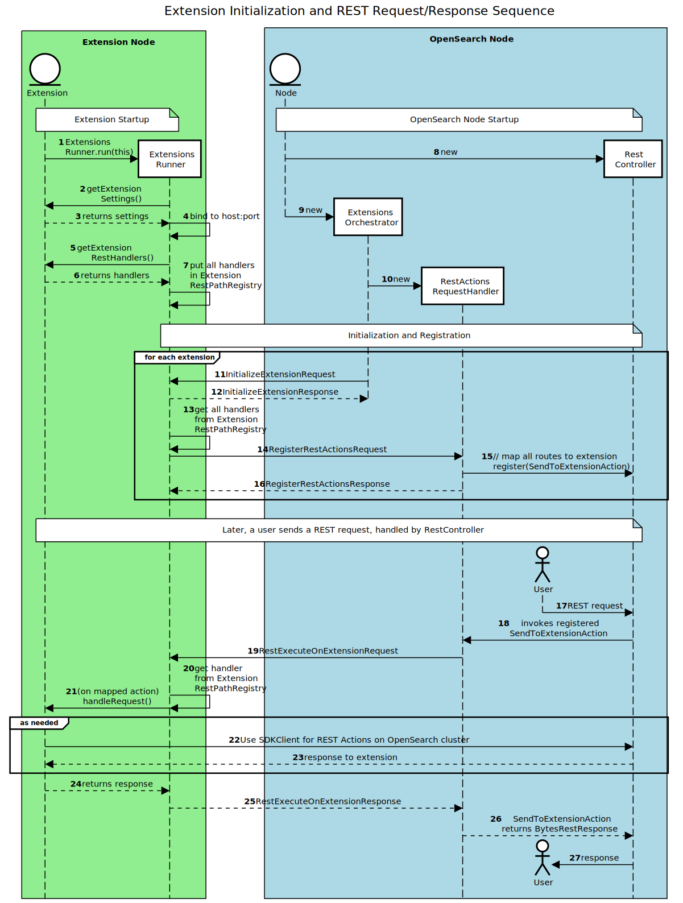

# Extensions

*Note*: This document is evolving and is in draft state.

Plugin architecture enables extending core features of OpenSearch. There are various kinds of plugins which are supported.
But, the architecture has significant problems for OpenSearch customers. Importantly, plugins can fatally impact the cluster
i.e critical workloads like ingestion/search traffic would be impacted because of a non-critical plugin like s3-repository failed with an exception.

This problem is exponentially grows when we would like to run a 3rd Party plugin from the community.  
As OpenSearch and plugins run in the same process, it brings in security risk, dependency conflicts and reduces the velocity of releases.

Introducing extensions, a simple and easy way to extend features of OpenSearch. It would support all plugin features and enable them to run in a seperate process or on another node via OpenSearch SDK Java.

Meta Issue: [Steps to make OpenSearch extensible](https://github.com/opensearch-project/OpenSearch/issues/2447)  
Sandboxing: [Step towards modular architecture in OpenSearch](https://github.com/opensearch-project/OpenSearch/issues/1422)  
Security: [Security for extensions](SECURITY.md) 

## Plugins Architecture


Plugins are installed via [`opensearch-plugin`](https://github.com/opensearch-project/OpenSearch/blob/main/distribution/tools/plugin-cli/src/main/java/org/opensearch/plugins/InstallPluginCommand.java) and are class loaded into OpenSearch.
Plugins run within OpenSearch as a single process. Plugins interface with OpenSearch via extension points which plug into the core modules of OpenSearch.
This [blog post](https://opensearch.org/blog/technical-post/2021/12/plugins-intro/) helps untangle how plugins work. 

Walking through an example, a Plugin would like to register a custom setting which could be toggled via Rest API by the user. 
The plugin uses compiles with OpenSearch x.y.z version and generates a `.zip`.   
This `.zip` file is installed via `opensearch-plugin` tool which unpacks the code and places it under `~/plugins/<plugin-name>`.
During the bootstrap of OpenSearch node, it class loads all the code under `~/plugins/` directory. `Node.java` makes a call to get all settings the plugins would like to register. These settings are used as `additionalSettings` and construct `SettingsModule` instance which tracks all settings.

## Extensions Architecture


Extensions are independent processes which are built using `opensearch-sdk-java`. They communicate with OpenSearch via [transport](https://github.com/opensearch-project/OpenSearch/tree/main/modules/transport-netty4) protocol which today is used to communicate between OpenSearch nodes.  

Extensions are designed to extend features via transport APIs which are exposed using extension points of OpenSearch.

### Discovery

Extensions are discovered and configured via `extensions.yml`, the same way we currently have `plugin-descriptor.properties` which is read by OpenSearch during the node bootstrap. `ExtensionsOrchestrator` reads through the config file at `~/extensions` and registers extensions within OpenSearch.

Here is an example extension configuration `extensions.yml`:

```
extensions:
  - name: sample-extension // extension name
    uniqueId: opensearch-sdk-1 // identifier for the extension
    hostName: 'sdk_host' // name of the host where extension is running
    hostAddress: '127.0.0.1' // host to reach
    port: '4532' // port to reach
    version: '1.0' // extension version
    description: Extension for the Opensearch SDK Repo // description of the extension
    opensearchVersion: '3.0.0' // OpenSearch compatibility
```

### Communication

Extensions will use a ServerSocket which binds them listen on a host address and port defined in their configuration file. Each type of incoming request will invoke code from an associated handler. 

OpenSearch will have its own configuration file, presently `extensions.yml`, matching these addresses and ports. On startup, the ExtensionsOrchestrator will use the node's TransportService to communicate its requests to each extension, with the first request initializing the extension and validating the host and port.

Immediately following initialization, each extension will establish a connection to OpenSearch on its own transport service, and send its REST API (a list of methods and URIs to which it will respond).  These will be registered with the RestController.

When OpenSearch receives a registered method and URI, it will send the request to the Extension. The extension will appropriately handle the request, using the API to determine which Action to execute.

### OpenSearch SDK for Java

Currently, plugins rely on extension points to communicate with OpenSearch, loaded into the class loader as Actions which extend `RestHandler`. The key part of this loading is each action's `routes()` method, which registers REST methods and URIs; upon receiving a matching request from a user the registered action handles the request.

Extensions will use a similar registration feature, but as a separate process will not need nor use many of the features of the `RestHandler` interface.  Instead, Extension Actions will implement the `ExtensionAction` interface which requires the extension developer to implement a `routes()` method (similar to plugins) and a `getExtensionResponse()` method to take action on the corresponding REST calls.

The sequence diagram below shows the process of initializing an Extension, registering its REST actions (API) with OpenSearch, and responding to a user's REST request.  A detailed description of the steps follows the diagram.

The `org.opensearch.sdk.sample` package contains a sample `HelloWorldExtension` implementing the below steps. It is executed following the steps in the [`DEVELOPER_GUIDE`](DEVELOPER_GUIDE.md).



#### Extension REST Actions Walk Through

##### Extension Startup

(1) Extensions must implement the `Extension` interface which requires them to define their settings (name, host address and port) and a list of `ExtensionRestHandler` implementations they will handle.  They are started up using a `main()` method which passes an instance of the extension to the `ExtensionsRunner` using `ExtensionsRunner.run(this)`.

(2, 3, 4) Using the `ExtensionSettings` from the extension, the `ExtensionsRunner` binds to the configured host and port.

(5, 6, 7) Using the `List<ExtensionRestHandler>` from the extension, the `ExtensionsRunner` stores each handler (Rest Action)'s restPath (method+URI) in a map, identifying the action to execute when that combination is received by the extension.

##### OpenSearch Startup, Extension Initialization, and REST Action Registration

(8, 9, 10) During bootstrap of the OpenSearch `Node`, it instantiates a `RestController`, passing this to the `ExtensionsOrchestrator` which subsequently passes it to a `RestActionsRequestHandler`.

The `ExtensionsOrchestrator` reads a list of extensions present in `extensions.yml`. For each configured extension:

(11, 12) The `ExtensionsOrchestrator` Initializes the extension using an `InitializeExtensionRequest`/`Response`, establishing the two-way transport mechanism.

(13) Each `Extension` retrieves all REST paths from its pathMap (the key set).

(14, 15, 16) Each `Extension` sends a `RegisterRestActionsRequest` to the `RestActionsRequestHandler`, which registers a `RestSendToExtensionAction` with the `RestController` to handle each REST path (`Route`). These routes rely on a globally unique identifier for the extension which users will use in REST requests, presently the Extension's `uniqueId`.

##### Responding to User REST Requests

(17) Users send REST requests to OpenSearch which are handled by the `RestController`.

(18) If the requests match the registered path/URI and `routes()` of an extension, it invokes the registered `RestSendToExtensionAction`.

(19) The `RestSendToExtensionAction` forwards the Method and URI to the Extension in a `RestExecuteOnExtensionRequest`.  (This class will be expanded iteratively as we add more features to include parameters, identity IDs or access tokens, and other information.)

(20) The `Extension` matches the Method and URI to its pathMap to retrieve the `ExtensionRestHandler` registered to handle that combination.

(21, 22) The appropriate `ExtensionRestHandler` handles the request, possibly executing complex logic, and eventually providing a response string.

(23, 24) The response string is relayed by the `Extension` to the `RestActionsRequestHandler` which uses it to complete the `RestSendToExtensionAction` by returning a `BytesRestResponse`.

(25) The User receives the response.

## FAQ

- Will extensions replace plugins?  
  Plugins will continue to be supported and extensions are preferred as they will be easier to develop, deploy, and operate.
- How is the latency going to be for extensions?
  https://github.com/opensearch-project/OpenSearch/issues/3012#issuecomment-1122682444
