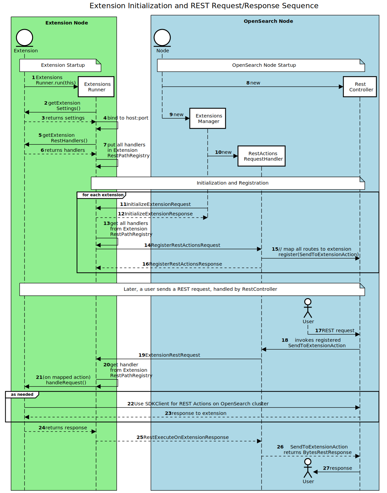
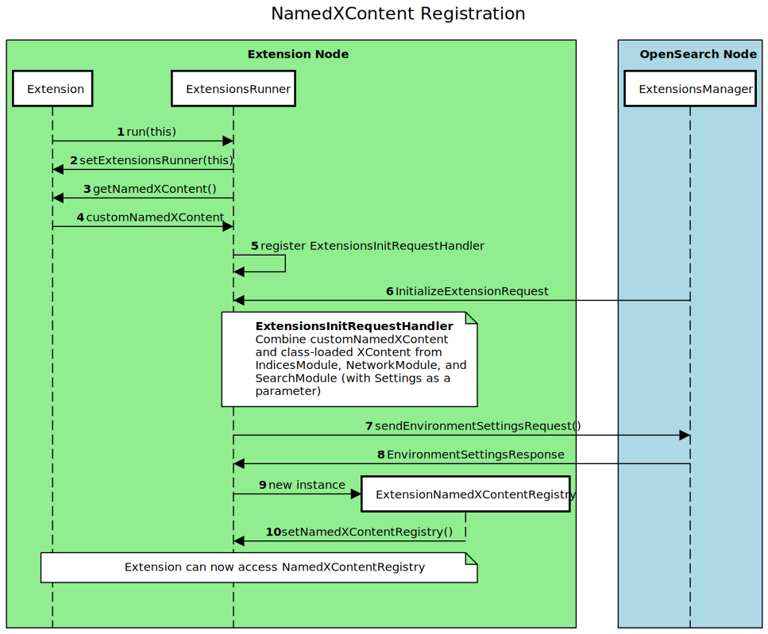

# Extensions

*Note*: This document is evolving and is in draft state.

OpenSearch supports many kinds of plugins that extend its core features. However, the plugin architecture presents significant problems because plugins can fatally impact a cluster in the event of failure. For example, critical workloads like ingestion or search traffic may be affected by a failure in a non-critical plugin, like `s3-repository`. Moreover, running third-party plugins by using the same process as OpenSearch poses a security risk, causes dependency conflicts, and complicates the release process.

Extensions support all plugin functionality and let you easily build features on top of OpenSearch. Using the OpenSearch SDK for Java, you can develop a plugin for OpenSearch that runs in a separate process or on another node.

For more information, explore the following resources:

* Meta Issue: [Steps to make OpenSearch extensible](https://github.com/opensearch-project/OpenSearch/issues/2447)

* Sandboxing: [Plugin sandboxing: A step toward modular architecture in OpenSearch](https://github.com/opensearch-project/OpenSearch/issues/1422)

* Security: [Security for extensions](SECURITY.md)

## Plugin architecture


You can install plugins using the [`opensearch-plugin`](https://github.com/opensearch-project/OpenSearch/blob/main/distribution/tools/plugin-cli/src/main/java/org/opensearch/plugins/InstallPluginCommand.java) command line tool. The plugin classes are then loaded into OpenSearch.
Each plugin runs within OpenSearch as a single process. Plugins interface with OpenSearch through extension points that plug in to the core OpenSearch modules.
For more information about how plugins work, see [Introduction to OpenSearch plugins](https://opensearch.org/blog/technical-post/2021/12/plugins-intro/).

For example, consider a plugin that would like to register a custom setting, which a user can toggle through the Rest API.
The plugin is compiled with the OpenSearch x.y.z version, generating a `.zip` file.
This `.zip` file is installed using the `opensearch-plugin` tool, which unpacks the code and places it in the `~/plugins/<plugin-name>` directory.
During the bootstrap of the OpenSearch node, the class loader loads all the code in the `~/plugins/` directory. The `Node` object makes a call to `PluginsService` to get all the settings the plugins would like to register and adds them to the `additionalSettings` list. The list is used to create a `SettingsModule` instance that tracks all settings.

## Extensions Architecture


Extensions are independent processes that are built using `opensearch-sdk-java`. They communicate with OpenSearch using the [transport protocol](https://github.com/opensearch-project/OpenSearch/tree/main/modules/transport-netty4), which OpenSearch nodes currently use to communicate with each other.

Extensions are designed to extend features through transport APIs, which are exposed using OpenSearch extension points.

### Discovery

Extensions are discovered and configured in the `extensions.yml` file, which is similar to the `plugin-descriptor.properties` file that is read by OpenSearch during the node bootstrap. `ExtensionsManager` reads through the config file in the `~/extensions` directory and registers extensions within OpenSearch.

The following is an example extension configuration in `extensions.yml`:

```yaml
extensions:
  - name: sample-extension // extension name
    uniqueId: opensearch-sdk-1 // identifier for the extension
    hostAddress: '127.0.0.1' // host address
    port: '4532' // port number
    version: '1.0' // extension version
    opensearchVersion: '3.0.0' // the OpenSearch version with which the extension is compiled
    minimumCompatibleVersion: '3.0.0' // minimum version of OpenSearch with which the extension is wire compatible
```

### Communication

Extensions use a `ServerSocket`, which binds them to listen on a host address and port defined in each extension's configuration file. Each type of incoming request invokes code from an associated handler.

OpenSearch has its own `extensions.yml` configuration file that matches the extensions' addresses and ports. On startup, the `ExtensionsManager` uses the node's `TransportService` to send requests to each extension, with the first request initializing the extension and validating the host and port.

Immediately following initialization, each extension establishes a connection to OpenSearch on its own transport service and sends its REST API to OpenSearch. The API contains a list of methods and URIs to which the extension will respond. These are registered with the `RestController`.

When OpenSearch receives a registered method and URI, it sends a request to the extension. The extension handles the request, using the API to determine which action to run.

### OpenSearch SDK for Java

Currently, plugins rely on extension points to communicate with OpenSearch. These extension points are loaded into the class loader as `Action` objects that implement _`RestHandler`_. The key part of this loading is each action's `routes()` method, which registers REST methods and URIs. Upon receiving a matching request from a user, the registered action handles the request.

Extensions use a similar registration feature, but extensions do not need or use many of the features of the _`RestHandler`_ interface because they run as separate processes. Instead, extension actions must implement the _`ExtensionAction`_ interface. This requires the extension developer to implement the `routes()` method to register REST methods (similar to plugins) and the `getExtensionResponse()` method to take action on the corresponding REST calls.

#### Wire compatibility

Extensions will be wire compatible across minor and patch versions. The configuration contains `minimumCompatibleVersion`, which is validated by `ExtensionsManager` in OpenSearch.

#### Extension REST actions walkthrough

The following sequence diagram depicts initializing an extension, registering its REST actions (API) with OpenSearch, and responding to a user's REST request. A detailed description of the steps follows the diagram.



The `org.opensearch.sdk.sample.helloworld` package contains a sample `HelloWorldExtension` that implements the preceding steps. You can run the sample extension by following the steps in the [developer guide](DEVELOPER_GUIDE.md).

##### Extension startup

(1) Extensions must implement the `Extension` interface, which requires extensions to define their settings (name, host address, and port) and a list of `ExtensionRestHandler` implementations they will handle. Extensions are started using a `main()` method, which passes an instance of the extension to the `ExtensionsRunner` by invoking `ExtensionsRunner.run(this)`.

(2, 3, 4) Using the extension's `ExtensionSettings`, the `ExtensionsRunner` binds to the configured host and port.

(5, 6, 7) Using the extension's `List<ExtensionRestHandler>`, the `ExtensionsRunner` stores each handler's (REST action) REST path (method and URI) in the `ExtensionRestPathRegistry`, identifying the action to perform when the extension receives this combination. This registry internally uses the same `PathTrie` implementation as OpenSearch's `RestController`.

##### OpenSearch Startup, Extension Initialization, and REST Action Registration

(8, 9, 10) During bootstrap, the OpenSearch `Node` instantiates a `RestController`, passing this to the `ExtensionsManager`, which subsequently passes it to a `RestActionsRequestHandler`.

The `ExtensionsManager` reads a list of extensions present in `extensions.yml`. For each configured extension:

(11, 12) The `ExtensionsManager` initializes the extension using an `InitializeExtensionsRequest`/`InitializeExtensionsResponse`, establishing a two-way transport mechanism.

(13) Each extension retrieves all of its REST paths from its `ExtensionRestPathRegistry`.

(14, 15, 16) Each extension sends a `RegisterRestActionsRequest` to the `RestActionsRequestHandler`, which registers a `RestSendToExtensionAction` with the `RestController` to handle each REST path (`Route`). These routes rely on the extension's `uniqueId`---a globally unique identifier that users provide in REST requests.

##### Responding to user REST requests

(17) Users send REST requests to OpenSearch. The requests are handled by the `RestController`.

(18) If the requests match the registered path/URI and `routes()` of an extension, the `RestController` invokes the registered `RestSendToExtensionAction`.

(19) The `RestSendToExtensionAction` forwards the method and URI to the extension in a `RestExecuteOnExtensionRequest` (this class will be expanded iteratively as we add more features to include parameters, identity IDs or access tokens, and other information).

(20) The extension matches the method and URI to its pathMap to retrieve the `ExtensionRestHandler` registered to handle that combination.

(21, 22) The appropriate `ExtensionRestHandler` handles the request, possibly executing complex logic, and eventually provides a response string.

(23, 24) As part of handling some requests, additional actions, such as creating an index, may require further interactions with OpenSearch's `RestController`. This is accomplished using the `SDKClient`, as required.

(25, 26) The extension relays the response string to the `RestActionsRequestHandler`, which uses the response to complete the `RestSendToExtensionAction` by returning a `BytesRestResponse`.

(27) The user receives the response.

#### Remote action execution on another extension

Extensions may invoke actions on other extensions using the `ProxyAction` and `ProxyActionRequest`, as shown in the following sequence diagram.


#### Extension point implementation walkthrough

The following is an example of a more complex extension point, `getNamedXContent()`. A similar pattern can be followed for most extension points.



##### Extension startup

(1, 2) Extensions initialize by passing an instance of themselves to the `ExtensionsRunner`. The first step in the constructor is for the `ExtensionsRunner` to pass its own instance back to the extension using the `setExtensionsRunner` method.

(3, 4) The _`Extension`_ interface includes extensions points such as `getNamedXContent()`, which returns an empty list by default. If `getNamedXContent()` is overridden, the extension will return a list of `NamedXContentRegistry.Entry`, which will be saved as `customNamedXContent`. Other extension points operate in a similar manner.

(5) The `ExtensionsRunner` registers an `ExtensionInitRequestHandler`, which will complete the initialization process on OpenSearch startup.

##### OpenSearch startup, extension initialization, and NamedXContent registration

(6) Upon receipt of an `InitializeExtensionRequest`, the `ExtensionInitRequestHandler` performs the following actions (among other actions):

(7, 8) Obtains environment settings from OpenSearch that are necessary for some core `XContent`.

(9, 10) Instantiates a new `SDKNamedXContentRegistry`, which is set on the `ExtensionsRunner`.
This registry uses the OpenSearch environment settings along with `NamedXContent` from several OpenSearch modules
and combines them with the extension's custom `NamedXContent`.

Because the extension has an instance of the `ExtensionsRunner`, it can now access the registry using the getter and pass it to extension REST handlers as needed.

## FAQ

- Will extensions replace plugins?
  Plugins will continue to be supported in the near future but are on a path to deprecation. Extensions are recommended for new development because they will be easier to develop, deploy, and operate.
- What is the latency for extensions?
  See [benchmarking tests](https://github.com/opensearch-project/OpenSearch/issues/3012#issuecomment-1122682444).
